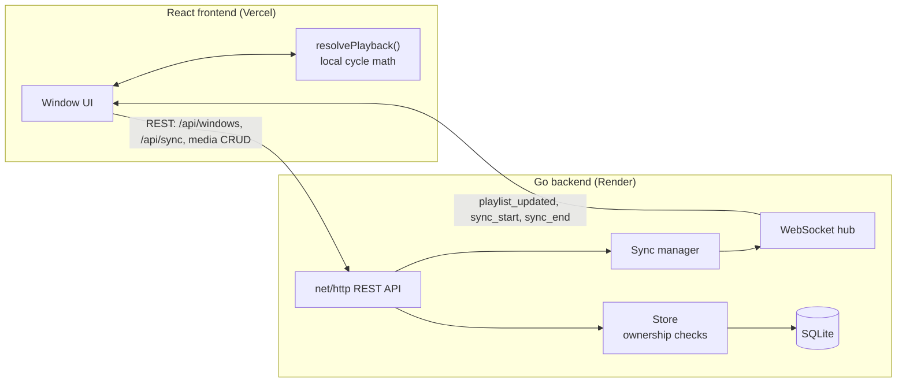

<div align="center">

# Multi-Window Media Sequencer

Independent 5-hour looping playlists per display window, with synced playback across all of them on demand.

[](https://frontend-drab-nine-hyk0lvk13g.vercel.app)
[](https://media-sequencer-backend-b80d.onrender.com)
[](backend/go.mod)
[](frontend/package.json)
[](backend/internal/db)

**[Live Frontend](https://frontend-drab-nine-hyk0lvk13g.vercel.app)** &nbsp;·&nbsp;
**[Live Backend API](https://media-sequencer-backend-b80d.onrender.com/api/health)** &nbsp;·&nbsp;


</div>

<br>

> Backend runs on Render's free tier: it sleeps after ~15 minutes idle
> (first request after that takes 30 to 60 seconds), and has no persistent
> disk, so the database resets on every container restart.

## What this is

Each display window loops its own media playlist on a fixed 5-hour cycle,
forever. Playlists can be edited live, changes apply on the next loop
without breaking playback. Triggering a sync makes every window jump to
one chosen item at the same moment, then each returns to exactly where its
own independent cycle already was.

| Requirement | Where it is handled |
|---|---|
| Continuous playback per window | `internal/sequencer.Resolve`, pure function of playlist, anchor, time |
| 5-hour cycle, restarts cleanly | Cycle boundary handled explicitly, tested against uneven playlists |
| Dynamic playlist updates | `POST`/`DELETE` on `/api/windows/{id}/media`, pushed live over WebSocket |
| Synced playback across all windows | Server-issued start/end timestamps, broadcast, clock-drift corrected |
| Persistent storage | SQLite (ephemeral on the current free-tier deploy, see below) |
| Image, video, blank support | All three render distinctly, with loading and error states |

## Tech stack

**Backend**


**Frontend**


**Deployment**


```
media-sequencer/
├── backend/     Go API and WebSocket server, SQLite storage, seed data
├── frontend/    React app (Vite)
└── docker-compose.yml
```

## Contents

- [Quick start](#quick-start)
- [Architecture](#architecture)
- [How the cycle and sync work](#how-the-cycle-and-sync-work)
- [API documentation](#api-documentation)
- [Configuration reference](#configuration-reference)
- [Deployment](#deployment)
- [Storage and persistence](#storage-and-persistence)
- [Assumptions and tradeoffs](#assumptions-and-tradeoffs)
- [Testing](#testing)

## Quick start

### Docker Compose, one command

```bash
docker compose up --build
```

| Service | URL |
|---|---|
| Frontend | http://localhost:5173 |
| Backend | http://localhost:8080 |

Seeds three demo windows (`W1`, `W2`, `W3`) on first run, stored in a
named Docker volume that survives `docker compose down` and back up.

> Unlike the live Render deploy (see [Storage and persistence](#storage-and-persistence)),
> this path actually persists data, it's the easiest way to see the
> storage layer working as intended.

### Run natively

```bash
# backend (Go 1.22+, needs a C compiler for mattn/go-sqlite3)
cd backend && cp .env.example .env && go run ./cmd/server
# -> :8080, seeds ./data/sequencer.db

# frontend (Node 18+)
cd frontend && cp .env.example .env.local && npm install && npm run dev
# -> http://localhost:5173
```

## Architecture



Every window's playback position is a pure function of its playlist and a
fixed `cycle_anchor`, no mutable "now playing" state to drift or
reconcile. The frontend runs the same math locally (`frontend/src/sequencer.js`,
tested against the Go version), so it advances via `setTimeout` instead of
polling every second.

## How the cycle and sync work

**Cycle:** `posInPlaylist = (now - anchor) mod 5h mod playlist_duration`,
then walk the playlist to find the active item. Consequences:

- The playlist loops continuously inside the 5-hour window, never "runs out."
- Blank only appears when configured as a playlist item, never a default fallback.
- The cycle restarts exactly at the 5-hour mark. If the playlist duration
  does not divide evenly, the item playing at that boundary is cut short
  so the next cycle starts cleanly at item 0.
- Adding/removing media takes effect immediately (`playlist_updated` push),
  the window's position in time is never affected.

Code: [`backend/internal/sequencer/sequencer.go`](backend/internal/sequencer/sequencer.go)
(`Resolve`, unit tested), mirrored in
[`frontend/src/sequencer.js`](frontend/src/sequencer.js).

**Sync:** a temporary display override, it never touches a window's
playlist or `cycle_anchor`.

1. `POST /api/sync` with `media_id` or an ad-hoc `{type, url}`.
2. Server picks a start time a few seconds out (`SYNC_LEAD_SECONDS`), so
   every client has time to receive the broadcast first.
3. Broadcasts `sync_start` with that exact start/end time over WebSocket.
4. Every client schedules local timers against those same timestamps
   (corrected for its own clock offset from the server), so all windows
   flip at effectively the same instant.
5. After `ends_at`, the server also broadcasts `sync_end`; each window
   just resumes evaluating `Resolve(playlist, anchor, now)`, exactly where
   it already was.

A late-joining or reconnecting client catches up correctly too:
`GET /api/windows` includes each window's live sync status, not only the
WebSocket push.

## API documentation

Base URL `http://localhost:8080`. JSON, RFC3339 UTC timestamps.

| Endpoint | Purpose |
|---|---|
| `GET /api/health` | Liveness check |
| `GET /api/windows` | All windows, playlists, resolved `now_playing`, sync status, server clock |
| `GET /api/windows/{id}` | One window, same shape |
| `GET /api/windows/{id}/now-playing` | Lightweight polling variant |
| `POST /api/windows/{id}/media` | Add `{type, url, duration_seconds}` to the playlist |
| `DELETE /api/windows/{id}/media/{mediaId}` | Remove an item, only if it belongs to `{id}` |
| `PUT /api/windows/{id}/media/reorder` | Rewrite order, `{ordered_ids}`, all-or-nothing |
| `POST /api/sync` | `{media_id}` or `{type, url}`, optional `duration_seconds` |
| `GET /api/sync/status` | Current/scheduled sync state |
| `GET /ws` | WebSocket: `playlist_updated`, `sync_start`, `sync_end` |

Example `GET /api/windows` entry:

```json
{
  "window": { "id": "W1", "name": "Window 1 - Lobby Display", "cycle_anchor": "...", "created_at": "..." },
  "playlist": [{ "id": 1, "window_id": "W1", "type": "image", "url": "https://...", "duration_seconds": 8, "position": 0 }],
  "now_playing": { "media_id": 1, "type": "image", "url": "https://...", "index": 0, "elapsed_seconds": 3, "remaining_seconds": 5 },
  "server_time": "2026-09-19T10:00:00Z",
  "sync": { "active": false }
}
```

**Ownership checks:** every `/windows/{windowId}/media/{mediaId}` endpoint
verifies `mediaId` actually belongs to `windowId` before touching it,
returning 404 instead of succeeding or leaking that the ID exists
elsewhere. See `Store.GetOwnedMedia` in
[`backend/internal/store/store.go`](backend/internal/store/store.go) and
`TestOwnershipIsEnforced` in
[`store_test.go`](backend/internal/store/store_test.go).

## Configuration reference

### Backend, `backend/.env.example`

| Variable | Default | Purpose |
|---|---|---|
| `PORT` | `8080` | Listen port |
| `DB_PATH` | `./data/sequencer.db` | SQLite file path |
| `ALLOWED_ORIGIN` | `*` | CORS origin |
| `SEED_ON_EMPTY` | `true` | Seed demo data on first run |
| `SYNC_LEAD_SECONDS` | `2` | Delay before a sync actually starts |
| `DEFAULT_SYNC_DURATION_SECONDS` | `10` | Fallback sync duration |
| `ADMIN_TOKEN` | unset | When set, mutating endpoints require `X-Admin-Token` to match |

### Frontend, `frontend/.env.example`

| Variable | Default | Purpose |
|---|---|---|
| `VITE_API_BASE_URL` | `http://localhost:8080` | Backend URL, WS URL derived from it |
| `VITE_ADMIN_TOKEN` | unset | Sent as `X-Admin-Token` when the backend requires it |

Vite variables are compile-time: pass via `--build-arg` for Docker, or as
a build-time env var on the hosting dashboard.

## Deployment

`render.yaml` and `frontend/vercel.json` are included for one-click setup.

**Backend, Render:** New → Blueprint → connect the repo. Deploy first with
`ALLOWED_ORIGIN=*`, note the URL, then set `ALLOWED_ORIGIN` to the
frontend's exact origin once it exists, and redeploy.

**Frontend, Vercel:** Add New → Project → root directory `frontend`. Set
`VITE_API_BASE_URL` to the Render URL, deploy.

**Then:** confirm CORS matches exactly, confirm `wss://<backend>/ws` isn't
blocked (Render/Vercel support it natively), and smoke test: add a media
item, trigger a sync, confirm it applies within `SYNC_LEAD_SECONDS`. Hit
`/api/health` once before a live demo to wake a sleeping free-tier
instance.

## Storage and persistence

SQLite needs no external service, is a single file, and comfortably
handles this scale. `internal/db` and `internal/store` are the only places
that would need to change to swap in Postgres or MySQL later.

The live deployment currently does not persist data across restarts:
Render's free tier has no attachable disk, so `render.yaml` runs SQLite on
the container's own ephemeral filesystem, wiped on every restart or
redeploy. Locally, or via `docker compose up` (which uses a real volume),
persistence works exactly as designed, that is the easiest way to verify
it. Fixing this for production means either a paid Render plan with a
disk at `/app/data`, or pointing `internal/db` at a small hosted Postgres
instance instead.

## Assumptions and tradeoffs
 
- **5-hour boundary cuts off the in-progress item** rather than letting it
  finish, so every window's boundary stays predictable. Isolated to
  `sequencer.Resolve` if a softer behavior is ever preferred.
- **Video duration is supplied by whoever adds the item**, not read from
  the file. Out of scope for arbitrary hosted URLs.
- **Sync targets are global**, not scoped to one window's own list, since
  the brief's own example implies syncing an item that may not be in
  every window's playlist.
- **`ADMIN_TOKEN` is opt-in, not full auth.** The brief doesn't ask for
  logins; this protects the public demo from tampering without pretending
  to be a real auth system.
- **CORS defaults to `*`** for easy grading, tighten `ALLOWED_ORIGIN` in
  any real deployment.
- **WebSocket with a 25s polling fallback**, so a dropped connection
  (which also auto-reconnects) never leaves the UI stale for long.
- **Images preload ahead of their turn** in the rotation, avoiding a blank
  frame on first load.
- **Graceful shutdown on SIGTERM/SIGINT**, and request bodies capped at
  64KB via `http.MaxBytesReader`, minimal hardening kept deliberately
  small.

## Testing

```bash
cd backend && go test ./... && go vet ./... && gofmt -l .
cd frontend && npm run build
```

Start with
[`sequencer_test.go`](backend/internal/sequencer/sequencer_test.go) (cycle
math) and
[`store_test.go`](backend/internal/store/store_test.go)
(`TestOwnershipIsEnforced`), they cover the two trickiest correctness
requirements in the brief.
